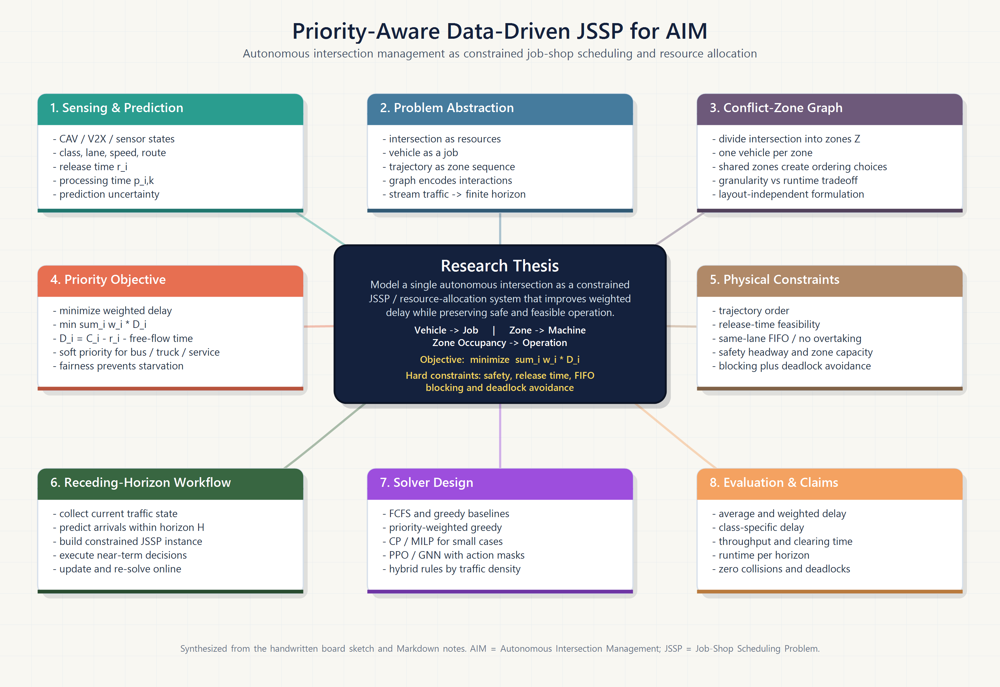
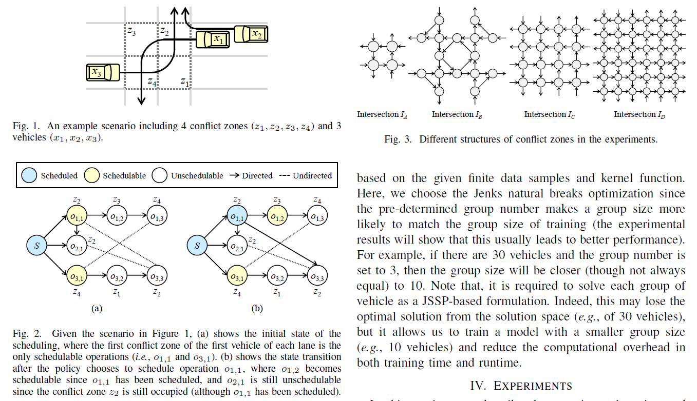

# Detailed Research Design: Priority-Aware Data-Driven JSSP for Autonomous Intersection Management

## Working title

**Priority-Aware Data-Driven Job-Shop Scheduling for Autonomous Intersection Management**

## 1. Core idea

The autonomous intersection management problem can be modeled as a **resource allocation and scheduling problem**.

The intersection is divided into several **conflict zones**. Each conflict zone is treated as a limited resource, similar to a machine in a Job-Shop Scheduling Problem (JSSP). Each vehicle is treated as a job. A vehicle's route through the intersection is treated as a sequence of operations, where each operation means that the vehicle occupies one conflict zone for a certain time.

The existing JSSP-RL paper already provides the foundation:

- Use a graph-based conflict-zone model for intersection management.
- Transform the graph-based intersection scheduling problem into a constrained JSSP.
- Add intersection-specific constraints, including blocking, deadlock, and arrival-time constraints.
- Model the scheduling process as a Markov Decision Process (MDP).
- Train a centralized intersection manager using Proximal Policy Optimization (PPO).

The proposed extension is to make the model more practical by considering **heterogeneous vehicles**. Different vehicles have different practical impacts. For example, buses carry many passengers, trucks occupy more space and may move more slowly, and emergency vehicles may require strict priority. Therefore, instead of treating all vehicles equally, the scheduler should optimize a **priority-aware weighted objective**.

## 2. Research question

**How can we schedule heterogeneous connected/autonomous vehicles through an unsignalized intersection by combining conflict-zone modeling, constrained JSSP, trajectory-data prediction, and reinforcement learning?**

More specifically:

1. How should an intersection be divided into conflict zones and represented as scheduling resources?
2. How should vehicles with different types, sizes, priorities, and trajectories be represented in a JSSP-style model?
3. How can trajectory data be used to predict arrival time and conflict-zone occupation time?
4. How can reinforcement learning or hybrid scheduling methods optimize vehicle passing order under safety constraints?
5. How can the model balance efficiency, safety, priority, and fairness?

## 3. Problem setting

We consider a connected/autonomous intersection controlled by a centralized intersection manager, such as a roadside unit or edge controller.

For each incoming vehicle, the system collects or estimates:

| Variable | Meaning |
|---|---|
| Vehicle ID | Unique vehicle identifier |
| Vehicle type | Car, bus, truck, emergency vehicle, etc. |
| Priority weight | Numerical priority used in the objective function |
| Source lane | Lane from which the vehicle enters the intersection |
| Destination movement | Straight, left turn, right turn, merge, lane change, etc. |
| Position, speed, acceleration | Current motion state |
| Earliest arrival time | Estimated time when the vehicle can enter the control zone |
| Vehicle length / size | Used to estimate safety gap and occupation time |
| Planned trajectory | Sequence of conflict zones to be passed |
| Predicted processing time | Time needed to pass each conflict zone |

The intersection is divided into a set of conflict zones:

\[
Z = \{z_1, z_2, \ldots, z_m\}
\]

Each vehicle has a route through the intersection:

\[
T_i = (z_{i,1}, z_{i,2}, \ldots, z_{i,n_i})
\]

where \(T_i\) is the ordered sequence of conflict zones used by vehicle \(i\).

## 4. Mapping autonomous intersection management to JSSP

The mapping between intersection management and JSSP is:

| Autonomous intersection concept | JSSP concept |
|---|---|
| Vehicle | Job |
| Conflict zone | Machine / resource |
| Vehicle passing one conflict zone | Operation |
| Time spent in a conflict zone | Processing time |
| Vehicle trajectory | Ordered operation sequence |
| Conflict between vehicles | Machine/resource conflict |
| Passing order decision | Scheduling decision |
| Safety gap | Setup/separation constraint |
| Bus/truck/emergency priority | Weighted scheduling objective |

For vehicle \(i\), operation \(o_{i,k}\) means:

\[
o_{i,k} = \text{vehicle } i \text{ occupying conflict zone } z_{i,k}
\]

The scheduler decides the start time:

\[
s_{i,k}
\]

and completion time:

\[
c_{i,k} = s_{i,k} + p_{i,k}
\]

where \(p_{i,k}\) is the processing time, meaning the time vehicle \(i\) needs to pass conflict zone \(z_{i,k}\).

## 5. Graph representation

The conflict graph can be represented with three types of timing constraints.

### Type-1: Trajectory order constraint

A vehicle must pass its conflict zones in the correct physical order.

Example:

\[
z_2 \rightarrow z_3 \rightarrow z_4
\]

This means the vehicle must finish zone \(z_2\) before entering \(z_3\), and must finish \(z_3\) before entering \(z_4\).

### Type-2: Same-lane no-overtaking constraint

If two vehicles come from the same lane, the rear vehicle should not pass before the front vehicle.

This preserves physical feasibility and prevents unrealistic overtaking inside the intersection control zone.

### Type-3: Conflict-zone ordering decision

If two vehicles from different lanes want to use the same conflict zone, the scheduler must decide which vehicle passes first.

This is the core scheduling decision.

## 6. Mathematical formulation

### 6.1 Sets and parameters

| Symbol | Meaning |
|---|---|
| \(X\) | Set of incoming vehicles |
| \(Z\) | Set of conflict zones |
| \(T_i\) | Trajectory of vehicle \(i\), represented as a sequence of conflict zones |
| \(r_i\) | Earliest arrival time of vehicle \(i\) |
| \(p_{i,k}\) | Time needed for vehicle \(i\) to pass its \(k\)-th conflict zone |
| \(w_i\) | Priority weight of vehicle \(i\) |
| \(h_{ij}\) | Safety headway between vehicle \(i\) and vehicle \(j\) |
| \(s_{i,k}\) | Start time of operation \(o_{i,k}\) |
| \(c_{i,k}\) | Completion time of operation \(o_{i,k}\) |
| \(C_i\) | Exit time of vehicle \(i\) from the intersection |

### 6.2 Arrival-time constraint

A vehicle cannot enter before it physically arrives:

\[
s_{i,1} \geq r_i
\]

### 6.3 Trajectory order constraint

A vehicle must follow its own conflict-zone sequence:

\[
s_{i,k+1} \geq s_{i,k} + p_{i,k}
\]

### 6.4 Conflict-zone capacity constraint

Two vehicles cannot occupy the same conflict zone at the same time:

\[
[s_{i,k}, s_{i,k}+p_{i,k}] \cap [s_{j,l}, s_{j,l}+p_{j,l}] = \emptyset
\]

if \(z_{i,k} = z_{j,l}\).

With safety headway, this can be written as a disjunctive scheduling constraint:

\[
s_{j,l} \geq s_{i,k} + p_{i,k} + h_{ij}
\]

or

\[
s_{i,k} \geq s_{j,l} + p_{j,l} + h_{ji}
\]

The scheduling method chooses one of these two orders.

### 6.5 Blocking constraint

Classical JSSP assumes that a job can leave a machine immediately after processing. In intersection management, a vehicle physically occupies a conflict zone until it can move to the next safe zone. Therefore, the next movement must be feasible before the current occupation can be released.

This is important for avoiding unrealistic schedules.

### 6.6 Deadlock constraint

The schedule should avoid circular waiting situations. For example, vehicle A may wait for vehicle B, vehicle B may wait for vehicle C, and vehicle C may wait for vehicle A.

The scheduler should either:

- reject actions that create deadlock, or
- add graph-based verification to ensure the directed conflict graph remains feasible.

### 6.7 Priority-aware weighted-delay objective

The base JSSP-RL model minimizes total delay. The proposed extension minimizes **weighted delay**:

\[
\min \sum_{i \in X} w_i D_i
\]

where vehicle delay is:

\[
D_i = C_i - r_i - \sum_{k=1}^{n_i} p_{i,k}
\]

Here:

- \(C_i\) is the time vehicle \(i\) leaves the intersection.
- \(r_i\) is its earliest arrival time.
- \(\sum p_{i,k}\) is its free-flow passing time.
- \(D_i\) is the extra waiting/scheduling delay.
- \(w_i\) is the vehicle priority weight.

A more complete objective can be:

\[
\min \sum_i w_i D_i + \alpha \sum_i S_i + \beta \sum_i E_i + \gamma F + \eta U
\]

where:

| Term | Meaning |
|---|---|
| \(D_i\) | Delay of vehicle \(i\) |
| \(S_i\) | Stop/braking penalty |
| \(E_i\) | Energy or fuel/emission proxy |
| \(F\) | Fairness penalty, to prevent starvation of low-priority vehicles |
| \(U\) | Schedule instability penalty, to avoid changing decisions too often |
| \(\alpha, \beta, \gamma, \eta\) | Tradeoff parameters |

## 7. Heterogeneous vehicle priority design

A possible first version of vehicle priority is:

| Vehicle type | Example priority weight | Reason |
|---|---:|---|
| Ordinary passenger car | 1.0 | Baseline |
| Truck | 1.2–1.8 | Larger size, slower movement, stronger influence on traffic flow |
| Bus | 2.0–3.0 | Carries many passengers; delay affects more people |
| Emergency vehicle | Very high weight or hard-priority rule | Safety-critical service |

Two approaches are possible.

### Soft priority

Use weights in the objective:

\[
\min \sum_i w_i D_i
\]

This lets high-priority vehicles receive better service while still allowing the scheduler to consider the whole system.

### Hard priority

For emergency vehicles, we may add a hard constraint:

\[
C_{emergency} \leq C_i
\]

for selected conflicting vehicles, or force emergency vehicles to be scheduled first when safety allows.

### Fairness issue

Priority should not cause starvation of ordinary vehicles. A fairness penalty can be added, such as:

\[
F = \max_i D_i - \min_i D_i
\]

or a penalty when any vehicle waits longer than a threshold:

\[
F = \sum_i \max(0, D_i - D_{max})
\]

## 8. Data-driven trajectory prediction

The data-driven part is used to estimate:

1. **Arrival time** to the intersection or first conflict zone.
2. **Processing time** in each conflict zone.
3. **Potential route/turning movement** if it is not known exactly.
4. **Uncertainty** in vehicle behavior.

Possible input features:

- Current position.
- Speed and acceleration.
- Lane ID.
- Vehicle type.
- Distance to stop line or control-zone boundary.
- Historical trajectories.
- Traffic density and queue length.

Possible prediction models:

| Model type | Use case |
|---|---|
| Constant-speed / kinematic model | Simple baseline |
| Car-following model | Human-driven or mixed traffic extension |
| Regression model | Predict arrival and processing time from data |
| LSTM/GRU trajectory prediction | Sequence-based trajectory prediction |
| Graph neural network | Interacting vehicles and conflict-zone graph |
| Uncertainty-aware model | Robust scheduling under uncertain arrival times |

For the first research stage, a simple kinematic prediction may be enough. Later, the model can be improved using collected trajectory data.

## 9. Receding-horizon predictive scheduling

The phrase from the board, “horizontal predictive,” can be formalized as **receding-horizon predictive scheduling** or **model predictive scheduling**.

At each decision time:

1. Collect the current state of all vehicles within the control range.
2. Predict which vehicles will arrive within a short horizon \(H\), for example 5–15 seconds.
3. Build a temporary conflict-zone/JSSP problem for those vehicles.
4. Solve the scheduling problem using a selected method.
5. Execute only the first part of the schedule.
6. Update vehicle states and repeat the process.

This is useful because vehicles arrive continuously. The scheduler does not need to solve the whole future traffic stream at once.

## 10. Reinforcement learning design

The RL agent acts as a centralized intersection manager.

### 10.1 State

The state can include:

- Conflict-zone graph structure.
- Occupancy status of each conflict zone.
- Schedulable operations.
- Vehicle type and priority weight.
- Vehicle position, speed, acceleration.
- Predicted arrival time to each conflict zone.
- Estimated processing time of each operation.
- Queue length of each lane.
- Remaining conflict zones for each vehicle.
- Current delay of each vehicle.

### 10.2 Action

Possible action definitions:

| Action type | Meaning |
|---|---|
| Operation dispatching | Choose the next vehicle-zone operation to schedule |
| Vehicle ordering | Choose which vehicle should pass next |
| Time-window allocation | Assign a conflict-zone time slot to a vehicle |
| Priority adjustment | Dynamically change priority based on context |

The most direct action space is **operation dispatching**, because it aligns well with the JSSP formulation.

### 10.3 Action masking

Invalid actions should be masked. An action is invalid if it:

- violates trajectory order,
- violates same-lane order,
- tries to use an occupied conflict zone,
- creates deadlock,
- schedules a vehicle before its arrival time,
- violates a safety headway constraint.

### 10.4 Reward

A simple reward is negative weighted delay:

\[
R_t = - \sum_i w_i \Delta D_i(t)
\]

A richer reward is:

\[
R_t = - \sum_i w_i \Delta D_i(t) - \lambda_1 \text{StopPenalty} - \lambda_2 \text{FairnessPenalty} - \lambda_3 \text{SafetyPenalty}
\]

Safety should usually be handled as a hard constraint. The safety penalty is only a backup for simulation-based learning.

### 10.5 Policy model

Possible policy models:

- PPO with graph neural network encoder.
- Graph Isomorphism Network encoder, following the JSSP-RL direction.
- Actor-critic architecture.
- Hybrid policy: greedy/FCFS at low density, RL at high density.

The uploaded base paper suggests that PPO is more useful in high traffic density, while greedy methods can perform better under low traffic density. This supports a hybrid strategy.

## 11. Alternative and baseline methods

The research should compare the proposed method with several baselines:

| Baseline | Purpose |
|---|---|
| Fixed traffic signal | Traditional control baseline |
| FCFS | Simple reservation-style baseline |
| Greedy scheduling | Fast rule-based scheduling baseline |
| Improved greedy with deadlock checking | Stronger graph-based baseline |
| CP-SAT / constraint programming | Offline optimal or near-optimal benchmark |
| Original PPO-JSSP | Direct comparison with the base method |
| Priority-aware heuristic | Check whether RL is better than simple weighted rules |

## 12. Evaluation metrics

The model should be evaluated with both general and priority-specific metrics.

| Metric | Meaning |
|---|---|
| Average delay | Overall efficiency |
| Weighted delay | Main priority-aware objective |
| Bus delay | Service quality for public transport |
| Truck delay | Impact on heavy vehicles |
| Emergency vehicle response delay | Safety-critical performance |
| Maximum delay | Fairness and starvation risk |
| Throughput | Vehicles passing per unit time |
| Queue length | Congestion level |
| Stop count / braking events | Comfort and energy proxy |
| Fuel/emission proxy | Sustainability metric |
| Collision count | Must be zero |
| Deadlock count | Must be zero |
| Runtime | Real-time feasibility |
| Schedule stability | Whether decisions change too frequently |

## 13. Related works

### 13.1 Reservation-based autonomous intersection management

**Dresner and Stone (2008)** proposed a multiagent reservation-based autonomous intersection management framework. The idea of reserving space-time resources is closely related to the conflict-zone scheduling idea.

### 13.2 Graph-based intersection management

**Lin et al. (2019)** proposed graph-based modeling, scheduling, and verification for intelligent vehicle intersection management. This is important because conflict zones can be represented as graph nodes/resources, and passing orders can be verified for safety and deadlock-freeness.

### 13.3 JSSP-RL for intersection management

**Huang et al. (2023)** proposed reinforcement-learning-based job-shop scheduling for intelligent intersection management. This is the direct base paper for the current idea. It transforms graph-based intersection management into a constrained JSSP, models the problem as an MDP, and trains the policy using PPO.

### 13.4 Optimization-based motion coordination

**Guney and Raptis (2020)** studied scheduling-based optimization for autonomous vehicle coordination at multilane intersections. This supports the idea that intersection management can be treated as a scheduling problem.

### 13.5 Centralized reinforcement learning

**Guan et al. (2020)** proposed centralized cooperation for connected and automated vehicles at intersections using PPO. This supports the feasibility of RL-based centralized intersection control.

### 13.6 Decentralized reinforcement learning

**Wu et al. (2019)** proposed decentralized coordination learning for autonomous intersection management. This can be used as a comparison direction if the project later extends from one centralized manager to distributed vehicle-level agents.

### 13.7 Surveys

**Khayatian et al. (2020)** surveyed intersection management for connected autonomous vehicles. This can provide background for signal-free intersection control, centralized and distributed approaches, and evaluation metrics.

## 14. Expected novelty

The proposed research can be positioned as an extension of the existing JSSP-RL intersection management method.

### Existing base direction

Graph-based AIM → constrained JSSP → MDP → PPO scheduling.

### Proposed extension

Graph-based AIM → priority-aware weighted constrained JSSP → data-driven trajectory prediction → receding-horizon RL/hybrid scheduling for heterogeneous vehicles.

Possible contributions:

1. **Priority-aware JSSP formulation** for heterogeneous autonomous intersection management.
2. **Weighted-delay objective** considering buses, trucks, emergency vehicles, and ordinary cars.
3. **Trajectory-data-driven prediction** of arrival time and conflict-zone occupation time.
4. **Receding-horizon scheduling framework** for continuous vehicle streams.
5. **Hybrid scheduling policy** that uses greedy/FCFS under low density and RL under high density.
6. **Fairness-aware priority mechanism** to avoid starvation of ordinary vehicles.
7. **Practical edge-computing deployment concept** for real-time intersection scheduling.

## 15. Edge computing and federated learning extension

This should be treated as a later-stage extension, not necessarily the first research target.

The roadside unit can act as an edge intersection manager. It receives vehicle trajectory and intention data, runs the scheduler locally, and sends speed or crossing-time instructions back to vehicles.

For multiple intersections, federated learning can be considered:

- Each intersection trains or fine-tunes a local scheduling model.
- Raw trajectory data stays local.
- Only model parameters or gradients are shared.
- This may improve privacy and reduce communication cost.

A reasonable project order is:

1. First, solve one intersection with priority-aware JSSP/RL.
2. Then, extend to multiple intersections or federated learning.

## 16. Implementation roadmap

### Stage 1: Reproduce the base framework

- Build a conflict-zone model for one intersection.
- Represent vehicle trajectories as conflict-zone sequences.
- Implement FCFS and greedy scheduling.
- Implement constrained JSSP formulation.
- Verify collision-free and deadlock-free schedules.

### Stage 2: Add heterogeneous vehicle priority

- Define vehicle types and priority weights.
- Modify the objective from total delay to weighted delay.
- Add fairness penalty.
- Compare priority-aware scheduling with equal-priority scheduling.

### Stage 3: Add data-driven prediction

- Collect or simulate trajectory data.
- Estimate arrival time and conflict-zone processing time.
- Test simple kinematic prediction first.
- Later test learning-based trajectory prediction.

### Stage 4: Develop RL or hybrid scheduler

- Define MDP state, action, reward, and action masks.
- Train PPO/GNN scheduler.
- Compare with greedy and optimization baselines.
- Test hybrid policy: greedy at low traffic density, RL at high density.

### Stage 5: Evaluation and paper writing

- Test different traffic densities.
- Test different vehicle-type ratios.
- Test different priority weight settings.
- Test robustness to prediction error.
- Write results and compare with related work.

## 17. Initial experiment design

### Scenario variables

| Variable | Possible values |
|---|---|
| Intersection type | Four-way intersection, T-intersection, multilane intersection |
| Traffic density | Low, medium, high |
| Vehicle mix | Cars only; cars + buses; cars + buses + trucks; emergency scenario |
| Priority weight | Equal weights; moderate priority; strong priority |
| Prediction accuracy | Perfect prediction; noisy prediction; learned prediction |

### Main comparisons

1. Equal-priority scheduling vs priority-aware scheduling.
2. Greedy vs PPO vs hybrid scheduling.
3. Fixed processing time vs data-driven processing time.
4. Low-density vs high-density traffic.
5. Small vehicle groups vs receding-horizon stream scheduling.

## 18. Main risks and mitigation

| Risk | Possible solution |
|---|---|
| RL training is slow | Start with greedy and CP-SAT baselines; use smaller groups; use action masking |
| RL does not generalize across intersections | Train per-intersection first; later study transfer learning |
| Priority causes unfairness | Add maximum-waiting-time or fairness penalty |
| Prediction error causes infeasible schedules | Use robust safety margins and rescheduling |
| Large problem size | Use grouping, receding horizon, and hybrid methods |
| Supervisor asks for clearer novelty | Emphasize heterogeneous vehicle priority + data-driven prediction + fairness |

## 19. Suggested first research focus

The first version should avoid being too broad. A strong first target is:

**Priority-aware constrained JSSP for heterogeneous autonomous intersection management.**

Then add RL and data-driven prediction after the formulation is clear.

Recommended first experiment:

1. Use one four-way intersection.
2. Divide it into conflict zones.
3. Generate vehicles with types: car, bus, truck.
4. Compare equal-priority scheduling and weighted-priority scheduling.
5. Use average delay, weighted delay, bus delay, truck delay, and fairness as metrics.
6. Add PPO after the rule-based and optimization baselines are working.

## 20. One-sentence summary

This project extends graph-based JSSP/RL intersection management by adding heterogeneous vehicle priority, trajectory-data prediction, and receding-horizon scheduling, aiming to improve safety, efficiency, and practical service quality for buses, trucks, emergency vehicles, and ordinary cars.
