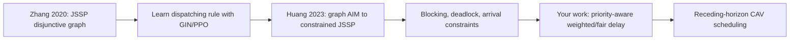
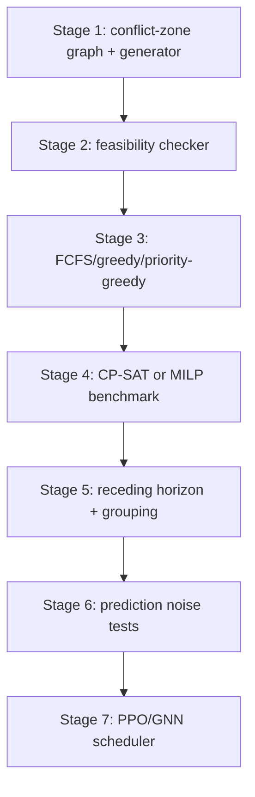

# Zhang 2020 + Huang 2023 Review and Next Research Plan

This note summarizes how Zhang et al. 2020 and Huang et al. 2023 connect to the current **priority-aware JSSP-based autonomous intersection management** project.

中文说明：这份笔记总结 Zhang et al. 2020 和 Huang et al. 2023 如何支撑当前的 **priority-aware JSSP-based autonomous intersection management** 研究方向，并给出下一步技术研究计划。

## 1. Two-Paper Core Idea

| Paper | Main idea | Why it matters |
| --- | --- | --- |
| Zhang et al. 2020 | Learn priority dispatching rules for standard JSSP using a disjunctive graph, GIN policy, and PPO. | Provides the generic graph-RL method for choosing the next operation in a scheduling problem. |
| Huang et al. 2023 | Transform graph-based autonomous intersection scheduling into constrained JSSP and train PPO for vehicle-zone operation dispatching. | Provides the direct bridge from JSSP-RL to intelligent intersection management. |
| This project | Extend constrained JSSP-AIM with heterogeneous vehicles, weighted/fair delay, trajectory-predicted conflict-zone occupation time, and receding-horizon scheduling. | Turns the method into a more practical traffic research problem with clearer novelty. |

中文总结：

| 论文 | 核心思想 | 对本研究的意义 |
| --- | --- | --- |
| Zhang et al. 2020 | 用 disjunctive graph、GIN 和 PPO 学习标准 JSSP 的 dispatching rule。 | 提供“图结构调度 + RL 选 operation”的通用方法。 |
| Huang et al. 2023 | 把 graph-based AIM 转换成 constrained JSSP，并用 PPO 调度 vehicle-zone operations。 | 是 JSSP-RL 和交叉口管理之间最直接的桥梁。 |
| 本项目 | 加入异构车辆优先级、weighted/fair delay、轨迹预测的 CZOT，以及 receding-horizon 调度。 | 使问题更贴近真实交通，并形成更清楚的 novelty。 |

## 2. RL Design Comparison

| RL element | Zhang et al. 2020 | Huang et al. 2023 | Proposed adaptation |
| --- | --- | --- | --- |
| Observation/state | Evolving disjunctive graph; scheduled indicator; completion lower bound. | Constrained graph/JSSP state for vehicle-zone operations. | Add vehicle class, priority weight, predicted arrival, processing/CZOT, zone occupancy, blocking status. |
| Action | Select one eligible operation. | Select one feasible operation after filtering by precedence, blocking, deadlock, and arrival constraints. | Select one safety-masked feasible vehicle-zone operation or vehicle dispatch decision. |
| Transition | Assign earliest feasible machine slot and orient disjunctive arcs. | Assign earliest feasible start time and update graph temporal relations. | Update conflict-zone availability, vehicle progress, lane FIFO edges, blocking states, and horizon commitments. |
| Reward | Difference in makespan lower-bound quality. | Extra delay introduced by the selected action. | Negative incremental weighted delay, optionally with fairness and schedule-stability penalties. |
| Stream/group strategy | Mostly static JSSP instances. | Group vehicles by arrival time and apply the trained policy group by group. | Use arrival-time grouping as part of receding-horizon scheduling with a commitment window. |

中文解释：

- Zhang 的 state 是标准 JSSP 的 evolving disjunctive graph，action 是选择 eligible operation，reward 对应 makespan lower-bound 的变化。
- Huang 把这个框架迁移到 AIM：state 变成 vehicle-zone operation graph，action 需要经过 blocking、deadlock、arrival time 等约束过滤，reward 变成 extra delay。
- 你的项目应继续扩展：state 加入 vehicle class、priority weight、预测 arrival/CZOT；reward 改成 weighted delay；action 由安全 mask 保证可行。

## 3. Current Repository Status

The repository is currently strong on proposal writing and literature organization:

- `ResearchPlan.md` already defines the priority-aware constrained JSSP direction.
- `Notes/01_detailed_research_design_priority_aware_jssp_aim.md` contains the main formulation ideas.
- `Notes/LiteratureReview_PriorityAware_JSSP_AIM.md` provides a broad literature map.
- `ThesisWriting/PriorityAwareJSSPAIMPaper/` contains an IEEE-style formulation draft.
- `ProjectCode/` is currently empty, so implementation has not started yet.

中文总结：

当前仓库主要处在 documentation/proposal 阶段，文字材料已经比较完整，但 `ProjectCode/` 还没有开始实现。因此下一步不应该马上训练 RL，而应该先做 simulator、feasibility checker 和 baseline scheduler。

## 4. Research Gap

Existing work already connects:

- reservation-based AIM,
- graph-based conflict-zone scheduling,
- constrained JSSP,
- PPO/GNN dispatching,
- arrival-time grouping for vehicle streams.

The remaining gap is:

> Existing graph/JSSP/RL intersection scheduling does not fully integrate heterogeneous vehicle priority, weighted and fair delay, trajectory-predicted conflict-zone occupation time, and online receding-horizon execution under explicit safety masks.

中文 gap 表述：

> 现有 graph/JSSP/RL 交叉口调度工作还没有系统整合异构车辆优先级、weighted/fair delay、轨迹预测得到的冲突区占用时间，以及带安全 mask 的在线 receding-horizon 调度。

## 5. Candidate Research Problems

1. **Priority-aware formulation**
   - How should buses, trucks, emergency vehicles, and ordinary cars be represented in a constrained JSSP-AIM model?
   - 中文：如何在 constrained JSSP-AIM 中表达公交、卡车、紧急车辆和普通车的不同影响？

2. **Safety-preserving RL**
   - How can a learned dispatching policy improve weighted delay while all unsafe actions are masked by release-time, conflict-zone, FIFO, blocking, and deadlock constraints?
   - 中文：如何让 RL 只在安全 action set 中选择调度动作，从而优化 weighted delay 但不破坏安全？

3. **Grouping and receding horizon**
   - How should continuous vehicle streams be divided into groups or horizons so that scheduling remains real-time and stable?
   - 中文：连续到达车辆应该如何分组或构造成 rolling horizon，才能实时且稳定？

4. **Prediction-aware scheduling**
   - How do arrival-time and conflict-zone occupation-time prediction errors affect feasibility, delay, and fairness?
   - 中文：arrival time 和 CZOT 预测误差如何影响可行性、delay 和 fairness？

5. **When does RL help?**
   - Under which density and heterogeneity conditions does PPO/GNN outperform FCFS, greedy, and priority-greedy?
   - 中文：在哪些交通密度和车辆异构程度下，PPO/GNN 才真正优于 FCFS、greedy 和 priority-greedy？

## 6. Technical Research Plan

| Stage | Goal | Output |
| --- | --- | --- |
| 1 | Define one four-way intersection conflict-zone graph and synthetic vehicle generator. | Vehicle streams with arrival time, lane, movement, class, and route. |
| 2 | Implement feasibility checker. | Release-time, zone-capacity, same-lane FIFO, blocking, deadlock checks. |
| 3 | Implement interpretable baselines. | FCFS, greedy earliest completion, priority-greedy, deadlock-aware greedy. |
| 4 | Add small-instance benchmark. | CP-SAT or MILP optimality-gap comparison for small horizons. |
| 5 | Add receding-horizon and grouping. | Arrival-time grouping, fixed horizon, commitment window, stability metric. |
| 6 | Add prediction noise. | Perfect information, kinematic prediction, noisy arrival/CZOT scenarios. |
| 7 | Add PPO/GNN. | Graph-policy scheduler trained only after baselines and masks are reliable. |

中文技术路线：

| 阶段 | 目标 | 输出 |
| --- | --- | --- |
| 1 | 定义一个四向交叉口冲突区图和 synthetic vehicle generator。 | 生成包含 arrival、lane、movement、class、route 的车辆流。 |
| 2 | 实现 feasibility checker。 | 检查 release time、zone capacity、FIFO、blocking、deadlock。 |
| 3 | 实现可解释 baseline。 | FCFS、greedy、priority-greedy、deadlock-aware greedy。 |
| 4 | 加入小规模 benchmark。 | 用 CP-SAT/MILP 验证 optimality gap。 |
| 5 | 加入 receding horizon 和 grouping。 | arrival-time grouping、fixed horizon、commitment window、stability metric。 |
| 6 | 加入 prediction noise。 | perfect information、kinematic prediction、noisy arrival/CZOT。 |
| 7 | 加入 PPO/GNN。 | 在 baseline 和 mask 稳定后训练 graph policy。 |

## 7. Baseline Ladder

Start simple and make every baseline use the same feasibility checker.

| Baseline | Purpose |
| --- | --- |
| FCFS | Reservation-style baseline; likely strong under low density. |
| Greedy earliest completion | Tests local delay minimization. |
| Priority-greedy | Tests whether weighted delay can be solved by simple heuristics. |
| Deadlock-aware greedy / iGreedy | Strong non-learning baseline with graph safety checking. |
| CP-SAT/MILP | Small-instance optimality benchmark. |
| Original PPO-style scheduler | Reproduces the Huang direction without priority. |
| Priority-aware PPO/GNN | Main learning method after the simulator is reliable. |
| Hybrid greedy/RL | Use greedy under low density and RL under high contention. |

中文建议：不要一开始就把重点放在 PPO。先把 FCFS、greedy、priority-greedy、deadlock-aware greedy 做好，这样后面 RL 的贡献才清楚。

## 8. Evaluation Metrics

| Metric | Why it matters |
| --- | --- |
| Average delay | General efficiency. |
| Weighted delay | Main priority-aware objective. |
| Class-specific delay | Bus/truck/emergency service quality. |
| Maximum delay | Starvation and fairness. |
| Throughput | Traffic-flow efficiency. |
| Runtime per horizon | Real-time feasibility. |
| Collision count | Must be zero. |
| Deadlock count | Must be zero. |
| Schedule changes | Stability under receding horizon. |
| Prediction-noise sensitivity | Robustness of online scheduling. |

中文指标：average delay、weighted delay、bus/truck/emergency delay、maximum delay、throughput、runtime、collision/deadlock count、schedule stability 和 prediction robustness 都需要报告。

## 9. Proposed Contribution Statement

English:

> This research formulates a priority-aware constrained JSSP for autonomous intersection management, where heterogeneous vehicles are scheduled through shared conflict zones using weighted/fair delay objectives, trajectory-predicted processing times, and safety-preserving action masks in an online receding-horizon framework.

中文：

> 本研究将自动交叉口管理建模为 priority-aware constrained JSSP：异构车辆通过共享冲突区时，调度器在安全 action mask 约束下，基于 weighted/fair delay、轨迹预测 processing time 和 online receding-horizon 框架进行调度。

## 10. Immediate Next Steps

1. Finalize the single-intersection conflict-zone layout.
2. Define the first vehicle classes and priority meanings:
   - car: baseline weight;
   - bus: person-delay weight;
   - truck: longer processing/headway, optional weight;
   - emergency: hard or near-hard priority when safety allows.
3. Implement a minimal simulator and feasibility checker in `ProjectCode/`.
4. Produce baseline plots before adding RL.
5. Use PPO/GNN only after the scheduling environment is stable.

中文下一步：

1. 先确定一个四向交叉口 conflict-zone layout。
2. 明确车辆类别和优先级含义。
3. 在 `ProjectCode/` 中实现 minimal simulator 和 feasibility checker。
4. 先跑 baseline 和画图，再训练 RL。
5. PPO/GNN 放在后面作为学习型调度器，不作为安全保证来源。
