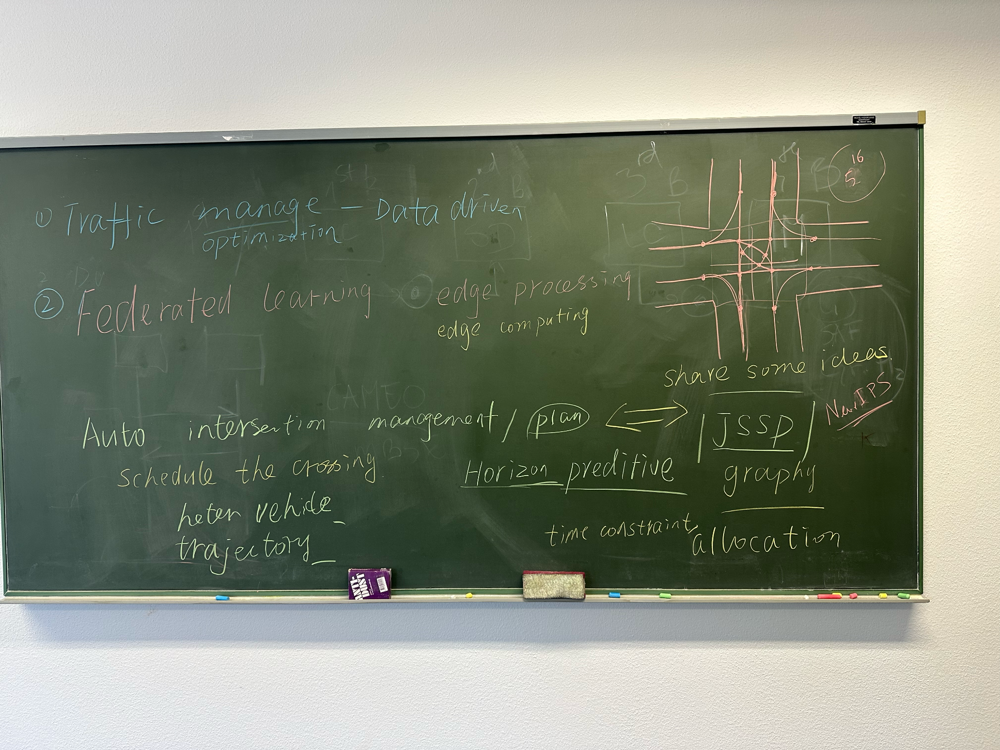

# JSSPIntersection

This repository organizes a research direction on **Job-Shop Scheduling Problem (JSSP)-based Autonomous Intersection Management (AIM)**. The main idea is to model a single autonomous intersection as a constrained scheduling/resource allocation problem: vehicles are jobs, conflict zones are resources, and each vehicle trajectory is a sequence of resource occupations.

The current plan builds on the DATE 2023 paper **"Reinforcement-Learning-Based Job-Shop Scheduling for Intelligent Intersection Management"** and extends the idea toward heterogeneous vehicles, weighted-priority delay, trajectory data, and receding-horizon predictive scheduling.




## Research Direction

The project studies how to schedule connected and autonomous vehicles through an intersection safely and efficiently.

Core idea:

- Divide the intersection into conflict zones.
- Treat each conflict zone as a shared resource.
- Treat each vehicle as a job with an arrival time, trajectory, class, and priority weight.
- Transform the crossing problem into a constrained JSSP.
- Optimize weighted total delay while enforcing safety, same-lane order, blocking, release-time, and deadlock constraints.
- Use reinforcement learning or data-driven dispatching to improve scheduling decisions under dense and heterogeneous traffic.

The planned vehicle model is:

```text
x_i = (r_i, t_i, class_i, w_i)
```

where `r_i` is the earliest arrival time, `t_i` is the trajectory, `class_i` is the vehicle type, and `w_i` is the delay weight. Buses, trucks, and emergency/service vehicles can therefore receive higher priority without relaxing safety constraints.

## Repository Structure

```text
.
|-- README.md
|-- ResearchPlan.md
|-- Doc/
|   |-- Reinforcement-learning-based_job-shop_scheduling_for_intelligent_intersection_management.pdf
|   |-- Reinforcement-Learning-Based Job-Shop Scheduling for Intelligent Intersection Management.pptx
|   |-- Yuself thesis Master Bilkent.pdf
|   |-- BilkentMaster_Designing non-monetary incentives for efficient selfish routing through strategic intersection control.html
|   |-- thesis_mechanism_figure.svg
|-- Notes/
|   |-- PaperAndMeetingIdea.md
|   |-- SupervisorEmailMap.md
|-- Pic/
|   |-- JSSPTraffic.png
|-- ProjectCode/
|-- RelatedPaper/
|-- ThesisWriting/
```

## Main Documents

- [ResearchPlan.md](ResearchPlan.md): detailed research design, including formulation, RL/MDP setup, baselines, evaluation metrics, risks, and references.
- [Notes/PaperAndMeetingIdea.md](Notes/PaperAndMeetingIdea.md): readable summary of the source paper and supervisor discussion.
- [Notes/SupervisorEmailMap.md](Notes/SupervisorEmailMap.md): email-ready map for agreeing on the research direction with the supervisor.
- [Doc/DATE 2023 PDF](Doc/Reinforcement-learning-based_job-shop_scheduling_for_intelligent_intersection_management.pdf): local copy of the source paper.
- [Pic/JSSPTraffic.png](Pic/JSSPTraffic.png): photo/sketch from the research discussion.

## Planned Method

The first implementation stage should focus on a single intersection:

1. Define the conflict-zone graph.
2. Generate or collect vehicle arrivals and trajectories.
3. Convert each horizon into a constrained-JSSP instance.
4. Implement FCFS, greedy, priority-weighted greedy, and deadlock-aware greedy baselines.
5. Add a reinforcement learning environment with action masking.
6. Train a PPO or graph-based dispatching policy.
7. Compare methods by average delay, weighted delay, class-specific delay, throughput, runtime, and deadlock-free feasibility.

## Current Status

Documentation stage:

- Research concept clarified.
- Source paper summarized.
- Supervisor email map prepared.
- Detailed research plan drafted.

Implementation has not started yet. `ProjectCode/` is currently reserved for future simulation, optimization, and reinforcement learning code.

## Source Paper

Shao-Ching Huang, Kai-En Lin, Cheng-Yen Kuo, Li-Heng Lin, Muhammed O. Sayin, and Chung-Wei Lin. "Reinforcement-Learning-Based Job-Shop Scheduling for Intelligent Intersection Management." DATE 2023. DOI: 10.23919/DATE56975.2023.10137280.
